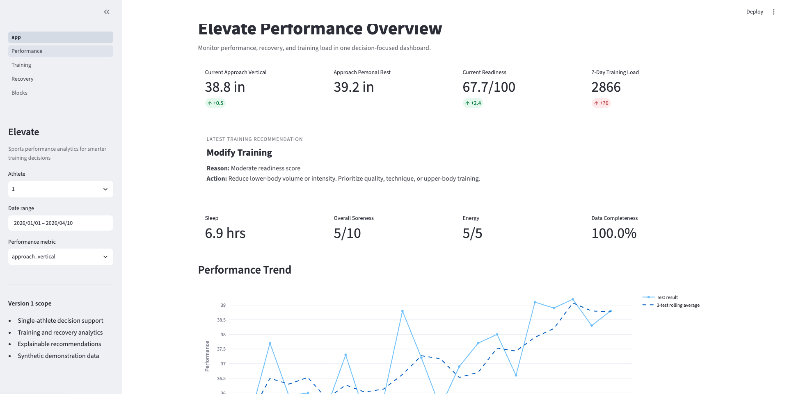
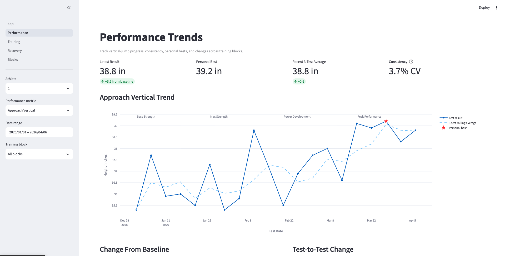
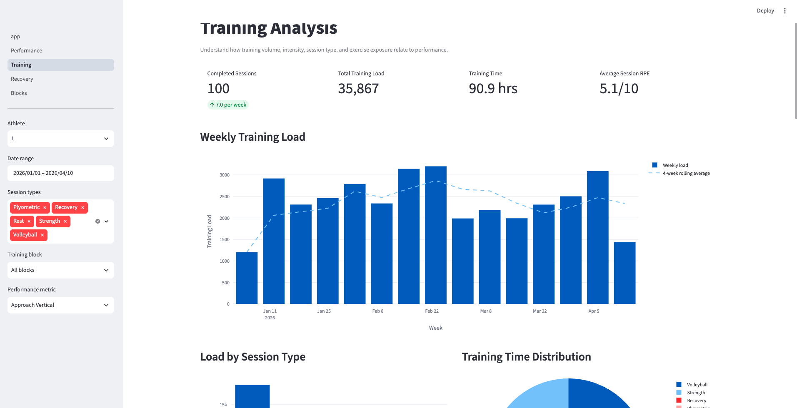
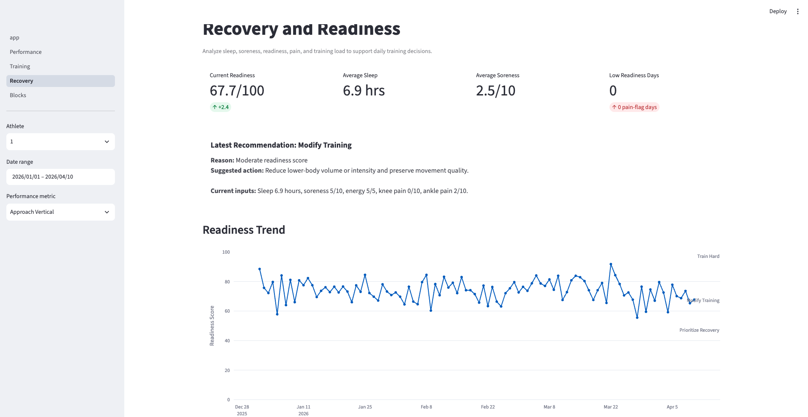
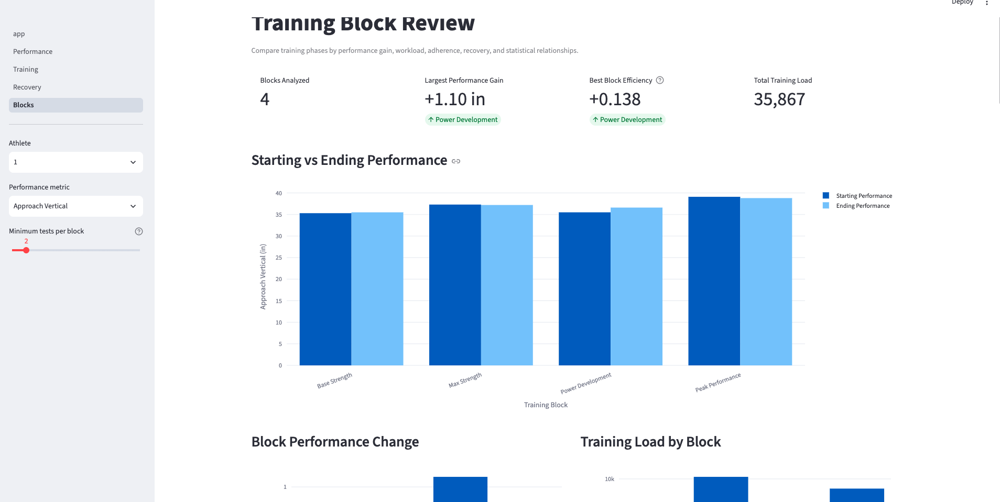

# Elevate

Elevate is a sports-performance analytics platform that helps athletes make smarter training and recovery decisions using data.

It combines training sessions, exercise exposure, wellness check-ins, and vertical-jump testing into one interactive dashboard.

The platform helps answer questions such as:

- Is performance improving?
- Which training blocks produced the largest gains?
- Does sleep relate to performance?
- Does soreness relate to lower jump results?
- Is recent training load unusually high?
- Should the athlete train hard, modify training, or prioritize recovery?

> Elevate is not a volleyball stat tracker. It is a training decision-support platform for athletes and coaches.

---

## Dashboard Preview











---

## Business Problem

Athletes often track workouts, sleep, soreness, and performance in separate places. This makes it difficult to understand whether training is working or whether recovery problems are affecting performance.

Elevate brings these data sources together into one analytical workflow.

The platform converts raw athlete data into:

- performance trends
- training-load metrics
- recovery KPIs
- training-block comparisons
- statistical relationships
- explainable training recommendations

The current MVP focuses on a competitive volleyball athlete trying to improve vertical jump and overall athletic performance.

---

## Features

### Executive Overview

- Current approach vertical
- Personal best
- Readiness score
- Seven-day training load
- Latest training recommendation
- Sleep, soreness, energy, and workload KPIs
- Performance, readiness, and training-load trends

### Performance Analysis

- Performance timeline
- Three-test rolling average
- Personal-best markers
- Change from baseline
- Test-to-test improvement
- Performance distribution
- Consistency metrics
- Training-block comparisons

### Training Analysis

- Weekly training load
- Load by session type
- Training-time distribution
- Exercise exposure
- Strength-training volume
- Plyometric jump contacts
- Performance following session types
- Training-session detail tables

### Recovery Analysis

- Readiness trend
- Readiness-component breakdown
- Previous-night sleep versus performance
- Soreness versus performance
- Recovery calendar
- Training load versus readiness
- Pain and fatigue warnings

### Training Block Review

- Starting versus ending performance
- Absolute and percentage improvement
- Total training load
- Training adherence
- Block efficiency
- Recovery averages
- Correlation matrix
- Exploratory regression
- Plain-English analytical summaries

---

## Technology Stack

| Layer | Technology |
|---|---|
| Database | SQLite |
| Querying | SQL |
| Data processing | Python |
| Data analysis | Pandas and NumPy |
| Statistics | Statsmodels and SciPy |
| Dashboard | Streamlit |
| Visualization | Plotly |
| Testing | Pytest |
| Version control | Git and GitHub |

---

## Architecture

```text
Synthetic CSV Data
        ↓
SQLite Database
        ↓
SQL Tables and Analytical Views
        ↓
Python and Pandas ETL Pipeline
        ↓
Processed Feature Datasets
        ↓
Streamlit and Plotly Dashboards
        ↓
Explainable Training Recommendations
```

---

## Database and ETL

Elevate uses six relational tables:

- `athletes`
- `training_blocks`
- `daily_wellness`
- `training_sessions`
- `exercise_sets`
- `performance_tests`

The database includes:

- primary keys
- foreign keys
- unique constraints
- input-range checks
- indexes
- session-load validation

The ETL pipeline:

1. Loads data from SQLite.
2. Converts dates and numeric fields.
3. Builds a data-quality report.
4. Aggregates daily training load.
5. Calculates seven-day and twenty-eight-day workload.
6. Creates lagged sleep and soreness variables.
7. Calculates readiness scores.
8. Generates training recommendations.
9. Calculates rolling performance trends.
10. Matches each performance test to the previous training session.
11. Exports dashboard-ready feature files.

Generated files:

```text
data/processed/daily_features.csv
data/processed/performance_features.csv
data/processed/data_quality_report.csv
```

---

## Main KPIs

### Performance

- Latest approach vertical
- Latest standing vertical
- Personal best
- Three-test rolling average
- Change from baseline
- Test-to-test change
- Performance consistency

### Training

- Session load
- Daily training load
- Seven-day training load
- Twenty-eight-day training load
- Load-spike ratio
- Sessions per week
- Strength volume
- Jump contacts
- Training adherence

### Recovery

- Readiness score
- Average sleep
- Average soreness
- Low-readiness days
- Pain-flag days
- Daily training recommendation

### Training Blocks

- Starting performance
- Ending performance
- Absolute improvement
- Percentage improvement
- Total block training load
- Block efficiency
- Adherence percentage

---

## Statistical Analysis

Elevate includes exploratory analysis using:

- Pearson correlation
- grouped comparisons
- lagged variables
- training-block comparisons
- ordinary least squares regression

The regression examines associations between performance and:

- previous-night sleep
- soreness
- seven-day training load
- readiness

These analyses describe relationships in the data. They do not prove causation.

---

## Project Structure

```text
Elevate/
├── app/
│   ├── app.py
│   └── pages/
│       ├── 1_Performance.py
│       ├── 2_Training.py
│       ├── 3_Recovery.py
│       └── 4_Blocks.py
│
├── data/
│   ├── raw/
│   └── processed/
│
├── sql/
│   ├── schema.sql
│   ├── analytics_views.sql
│   └── dashboard/
│
├── src/
│   ├── create_database.py
│   └── etl_pipeline.py
│
├── tests/
│   └── test_features.py
│
├── assets/
├── requirements.txt
└── README.md
```

---

## Installation

Install dependencies:

```bash
python3 -m pip install -r requirements.txt
```

Build the database:

```bash
python3 src/create_database.py
```

Run the ETL pipeline:

```bash
python3 src/etl_pipeline.py
```

Run the tests:

```bash
python3 -m pytest -v
```

Launch the dashboard:

```bash
python3 -m streamlit run app/app.py
```

---

## Testing

The project includes automated tests for:

- readiness-score range
- valid recommendation categories
- nonnegative training load
- nonnegative previous-session time differences
- expected performance metrics
- unique performance-test identifiers

---

## Data Disclaimer

The current portfolio version uses synthetic demonstration data.

The dataset is used to:

- demonstrate dashboard functionality
- test filters and calculations
- support reproducible analysis
- avoid exposing private athlete information

Synthetic findings should not be interpreted as real sports-science conclusions.

---

## Limitations

- The current dataset is synthetic.
- Wellness inputs are self-reported.
- Performance can be affected by testing conditions.
- Correlation does not prove causation.
- The regression model is exploratory.
- Readiness thresholds are training heuristics, not medical guidance.
- The current app does not connect to wearables or training platforms.

---

## Future Improvements

Potential future improvements include:

- athlete data-entry forms
- coach-facing multi-athlete dashboards
- individualized readiness thresholds
- wearable integrations
- COROS or Garmin imports
- automated weekly reports
- real athlete testing data
- authentication and user accounts

---

## Skills Demonstrated

- SQL
- Python
- Pandas
- NumPy
- Streamlit
- Plotly
- SQLite
- relational database design
- ETL development
- dashboard design
- KPI development
- correlation analysis
- regression
- feature engineering
- data validation
- automated testing
- product scoping
- analytical storytelling

---

## Author

Wilson Zheng

UVA undergraduate interested in business analytics, data analytics, sports technology, and decision-support products.